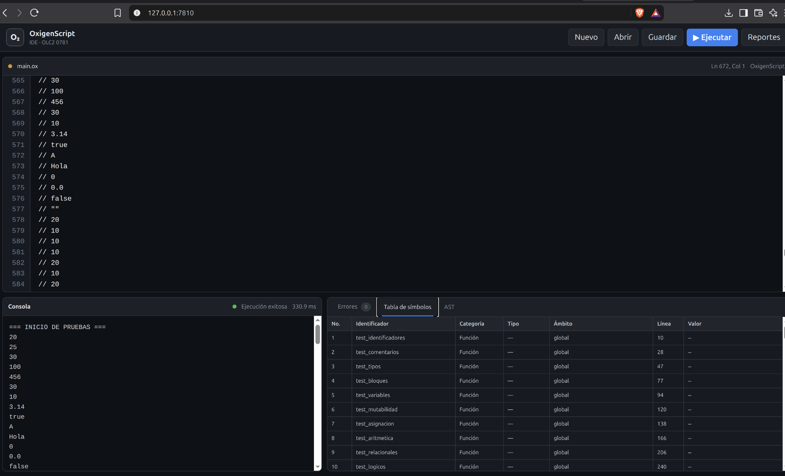
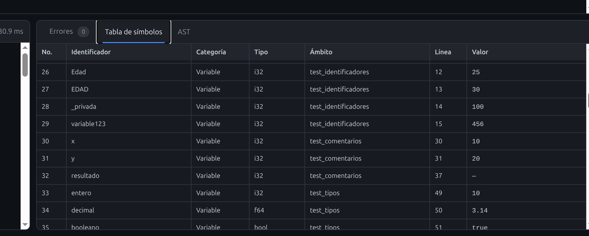

# Manual de Usuario — OxigenScript

## 1. Instalación

```bash
git clone https://github.com/danielcardona244/OLC2_B_P1_2S2026.git
cd OLC2_B_P1_2S2026

python3 -m venv .venv
source .venv/bin/activate

sudo apt update
sudo apt install graphviz

pip install -r requirements.txt
```

## 2. Iniciar

```bash
python manage.py runserver 127.0.0.1:7810
```

Abrir:

```text
http://127.0.0.1:7810/
```

## 3. Interfaz



La pantalla contiene barra de herramientas, editor, consola y panel de reportes.

## 4. Nuevo

Presionar **Nuevo** para limpiar el editor y comenzar un archivo.

## 5. Abrir

Presionar **Abrir** y seleccionar un `.ox` o `.txt`.

Atajo:

```text
Ctrl + O
```

## 6. Editar

El editor muestra numeración de líneas y posición de línea/columna.

Ejemplo:

```rust
fn main() {
    let x: i32 = 10;
    let y: i32 = 20;
    println!("{}", x + y);
}
```

## 7. Guardar

Presionar **Guardar**.

Atajo:

```text
Ctrl + S
```

## 8. Ejecutar

Presionar **Ejecutar**.

Atajo:

```text
Ctrl + Enter
```

Flujo:

```text
Lexer → Parser → AST → Semántica → Runtime → Reportes
```

## 9. Consola

Muestra la salida de `println!`, el estado y el tiempo de ejecución.

## 10. Errores

La pestaña **Errores** muestra:

```text
No.
Tipo
Descripción
Línea
Columna
Fragmento
```

## 11. Tabla de símbolos



Columnas:

```text
No.
Identificador
Categoría
Tipo
Ámbito
Línea
Valor
```

`Ámbito` indica el scope donde fue declarado el símbolo.

## 12. AST

La pestaña **AST** muestra la representación gráfica generada con Graphviz.

## 13. Ejemplo

```rust
fn sumar(a: i32, b: i32) -> i32 {
    return a + b;
}

fn main() {
    let resultado = sumar(10, 20);
    println!("Resultado: {}", resultado);
}
```

Salida:

```text
Resultado: 30
```

## 14. Prueba completa

Abrir desde la GUI:

```text
tests/fixtures/prueba_auxiliar.ox
```

Ejecutarlo y revisar consola, errores, tabla de símbolos y AST.

## 15. Problemas comunes

Verificar Django:

```bash
python manage.py check
```

Verificar Graphviz:

```bash
dot -V
```

Ejecutar pruebas:

```bash
python -m pytest -v
```

Para cerrar el servidor:

```text
Ctrl + C
```
