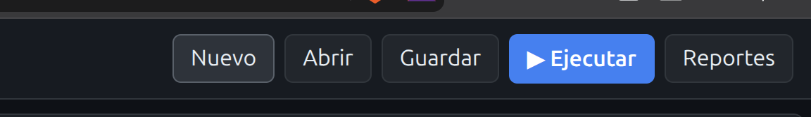
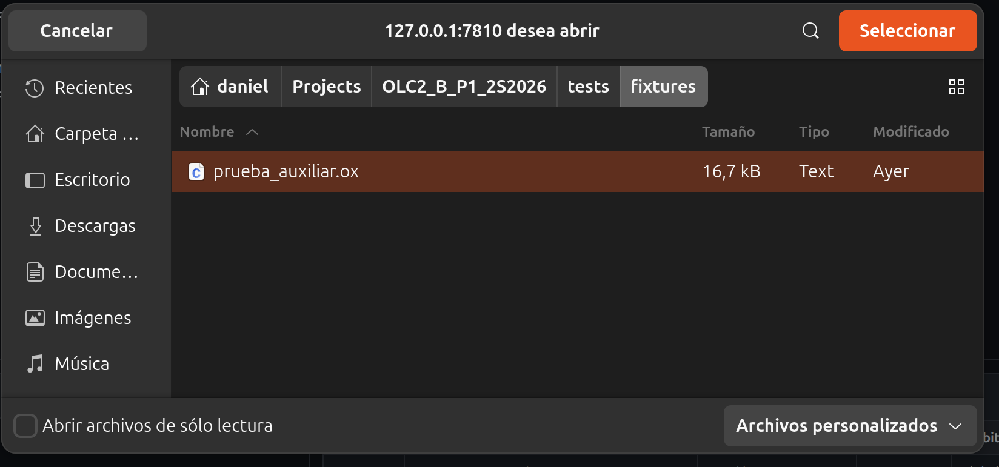
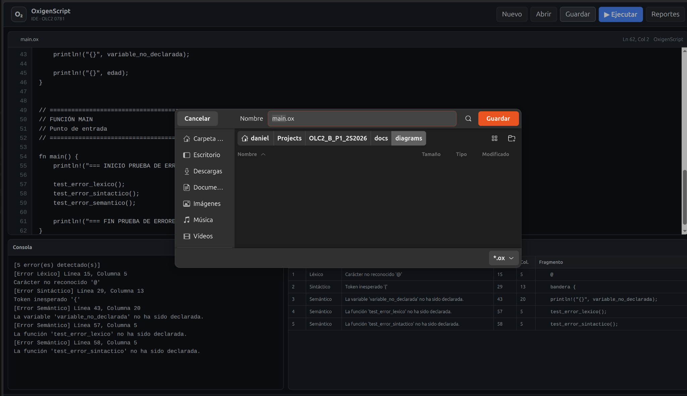
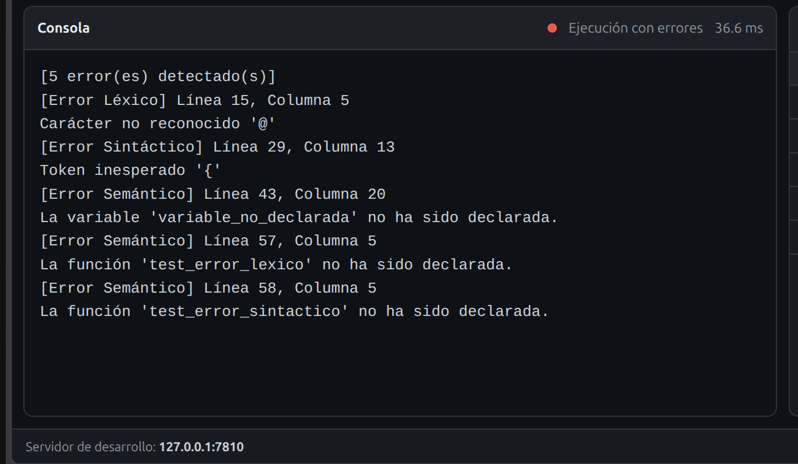
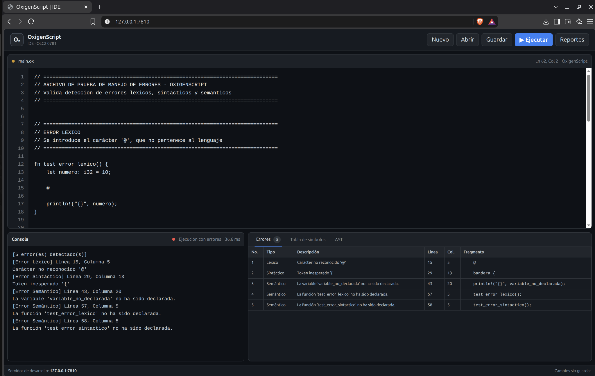
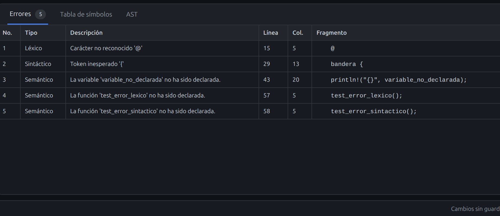
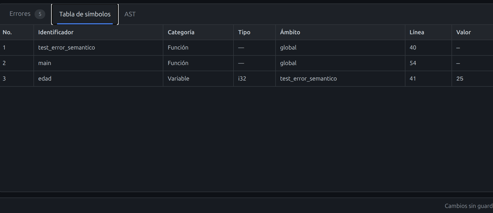
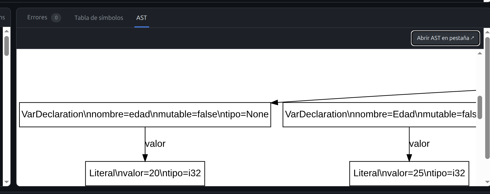

# Manual de Usuario — OxigenScript IDE

## 1. Introducción

**OxigenScript IDE** es una aplicación web para escribir, abrir, guardar, analizar y ejecutar programas escritos en OxigenScript. La interfaz integra en una sola pantalla el editor de código, la consola de salida y los reportes generados por el intérprete.

La herramienta permite:

- crear y editar código OxigenScript;
- abrir archivos `.ox` o `.txt`;
- guardar el contenido del editor;
- ejecutar el programa;
- visualizar errores léxicos, sintácticos y semánticos;
- consultar la tabla de símbolos;
- visualizar el AST generado con Graphviz;
- abrir el AST en una pestaña independiente para facilitar su inspección.

---

## 2. Requisitos

Se requiere:

- sistema operativo Linux;
- Python 3.12 o compatible;
- `venv`;
- dependencias incluidas en `requirements.txt`;
- Graphviz;
- navegador web moderno.

Para instalar Graphviz en Ubuntu/Debian:

```bash
sudo apt update
sudo apt install graphviz
```

Para verificar la instalación:

```bash
dot -V
```

---

## 3. Instalación

Clonar el repositorio:

```bash
git clone https://github.com/danielcardona244/OLC2_B_P1_2S2026.git
cd OLC2_B_P1_2S2026
```

Crear el entorno virtual:

```bash
python3 -m venv .venv
```

Activarlo:

```bash
source .venv/bin/activate
```

Instalar dependencias:

```bash
pip install -r requirements.txt
```

---

## 4. Iniciar la aplicación

Ejecutar:

```bash
python manage.py runserver 127.0.0.1:7810
```

Abrir en el navegador:

```text
http://127.0.0.1:7810/
```

El proyecto utiliza el puerto **7810**.

---

## 5. Interfaz principal

La interfaz está compuesta por:

1. barra superior de acciones;
2. editor de código;
3. consola;
4. panel de reportes;
5. barra de estado.

### 5.1 Botones principales



**Figura 1. Botones principales de OxigenScript IDE.**

Los botones disponibles son:

- **Nuevo:** crea un archivo nuevo en el editor.
- **Abrir:** permite seleccionar un archivo del sistema.
- **Guardar:** descarga o guarda el contenido actual del editor.
- **Ejecutar:** envía el código al intérprete.
- **Reportes:** permite acceder a los reportes generados.

Atajos:

```text
Ctrl + O       Abrir
Ctrl + S       Guardar
Ctrl + Enter   Ejecutar
```

---

## 6. Crear un archivo nuevo

Presionar **Nuevo**. El editor vuelve a un programa base similar a:

```rust
fn main() {
    println!("Hola, OxigenScript!");
}
```

---

## 7. Abrir un archivo

Presionar **Abrir**.



**Figura 2. Selección de un archivo `.ox`.**

Se recomienda trabajar con archivos `.ox`.

---

## 8. Editar código

El editor muestra numeración de líneas, posición actual de línea y columna, nombre del archivo e indicador de cambios sin guardar.

Ejemplo:

```rust
fn sumar(a: i32, b: i32) -> i32 {
    return a + b;
}

fn main() {
    let resultado = sumar(10, 20);
    println!("Resultado: {}", resultado);
}
```

---

## 9. Guardar código

Presionar **Guardar**.



**Figura 3. Guardado de un programa OxigenScript.**

---

## 10. Ejecutar un programa

Presionar **Ejecutar** o utilizar `Ctrl + Enter`.

Flujo:

```text
Código fuente
    ↓
Lexer
    ↓
Parser
    ↓
AST
    ↓
Análisis semántico
    ↓
Runtime
    ↓
Reportes
```

Cuando el programa no contiene errores bloqueantes, el runtime ejecuta `main`.

---

## 11. Consola

La consola muestra salida de `println!`, cantidad y detalle de errores, estado de ejecución y tiempo empleado.



**Figura 4. Consola mostrando errores detectados.**

---

## 12. Manejo de errores

OxigenScript IDE registra errores **léxicos**, **sintácticos** y **semánticos**.

### 12.1 Léxico

```rust
@
```

### 12.2 Sintáctico

```rust
bandera {
    println!("Error");
}
```

### 12.3 Semántico

```rust
println!("{}", variable_no_declarada);
```

La aplicación intenta continuar el análisis cuando el error es recuperable, por lo que puede reportar varios errores en una misma corrida.



**Figura 5. Ejecución con errores de distintos tipos.**

---

## 13. Reporte de errores

La pestaña **Errores** muestra número, tipo, descripción, línea, columna y fragmento.



**Figura 6. Reporte de errores dentro de la GUI.**

---

## 14. Tabla de símbolos

La pestaña **Tabla de símbolos** muestra:

```text
No.
Identificador
Categoría
Tipo
Ámbito
Línea
Valor
```

El campo **Ámbito** identifica el scope donde fue declarado el símbolo.

Con errores recuperables, el analizador puede producir una tabla parcial con los símbolos que sí pudo reconocer.



**Figura 7. Tabla de símbolos parcial en presencia de errores.**

---

## 15. AST

La pestaña **AST** muestra el Árbol de Sintaxis Abstracta construido por el parser.

Existe el botón **Abrir AST en pestaña ↗** para facilitar la visualización.



**Figura 8. Visualización del AST con apertura externa.**

En la pestaña independiente se puede usar el zoom del navegador:

```text
Ctrl + +       Acercar
Ctrl + -       Alejar
Ctrl + 0       Restablecer
```

---

## 16. Ejecución válida

```rust
fn sumar(a: i32, b: i32) -> i32 {
    return a + b;
}

fn main() {
    let resultado: i32 = sumar(10, 5);
    println!("Resultado: {}", resultado);
}
```

Salida:

```text
Resultado: 15
```

---

## 17. Archivo de prueba del auxiliar

El proyecto incluye:

```text
tests/fixtures/prueba_auxiliar.ox
```

Para probarlo:

1. iniciar el servidor;
2. abrir la GUI;
3. presionar **Abrir**;
4. seleccionar `prueba_auxiliar.ox`;
5. ejecutar;
6. revisar consola, errores, símbolos y AST.

---

## 18. Solución de problemas

### Django no inicia

```bash
source .venv/bin/activate
python manage.py check
```

### AST no disponible

```bash
dot -V
```

### Puerto ocupado

```bash
python manage.py runserver 127.0.0.1:7811
```

---

## 19. Cerrar la aplicación

En la terminal del servidor:

```text
Ctrl + C
```

---

## 20. Conclusión

OxigenScript IDE integra edición, análisis, ejecución y reportes dentro de una misma interfaz, facilitando tanto la prueba del lenguaje como la depuración de errores y la inspección del AST y la tabla de símbolos.
