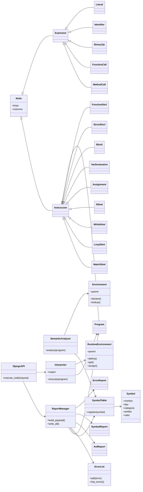

# Diagrama de clases

```mermaid
classDiagram
direction LR

class ErrorList {
  +add(error)
  +has_errors()
}

class Nodo {
  +linea
  +columna
}
class Expresion
class Instruccion
Nodo <|-- Expresion
Nodo <|-- Instruccion

class Program
class FunctionDecl
class StructDecl
class Block
class VarDeclaration
class Assignment
class IfStmt
class WhileStmt
class LoopStmt
class MatchStmt
class Literal
class Identifier
class BinaryOp
class FunctionCall
class MethodCall

Instruccion <|-- Program
Instruccion <|-- FunctionDecl
Instruccion <|-- StructDecl
Instruccion <|-- Block
Instruccion <|-- VarDeclaration
Instruccion <|-- Assignment
Instruccion <|-- IfStmt
Instruccion <|-- WhileStmt
Instruccion <|-- LoopStmt
Instruccion <|-- MatchStmt

Expresion <|-- Literal
Expresion <|-- Identifier
Expresion <|-- BinaryOp
Expresion <|-- FunctionCall
Expresion <|-- MethodCall

class SemanticAnalyzer {
  +analyze(program)
}
class Environment {
  +parent
  +declare()
  +lookup()
}
class SymbolTable {
  +register(symbol)
}
class Symbol {
  +nombre
  +tipo
  +categoria
  +ambito
  +valor
}

SemanticAnalyzer --> Environment
SemanticAnalyzer --> SymbolTable
SymbolTable --> Symbol

class RuntimeEnvironment {
  +parent
  +define()
  +get()
  +assign()
}

class Interpreter {
  +execute(program)
  +output
}

Interpreter --> RuntimeEnvironment
Interpreter --> Program

class ReportManager {
  +build_payload()
  +write_all()
}
class ErrorReport
class SymbolReport
class AstReport

ReportManager --> ErrorReport
ReportManager --> SymbolReport
ReportManager --> AstReport
ReportManager --> ErrorList
ReportManager --> SymbolTable
ReportManager --> Program

class DjangoAPI {
  +execute_code(request)
}
DjangoAPI --> Interpreter
DjangoAPI --> ReportManager
```
