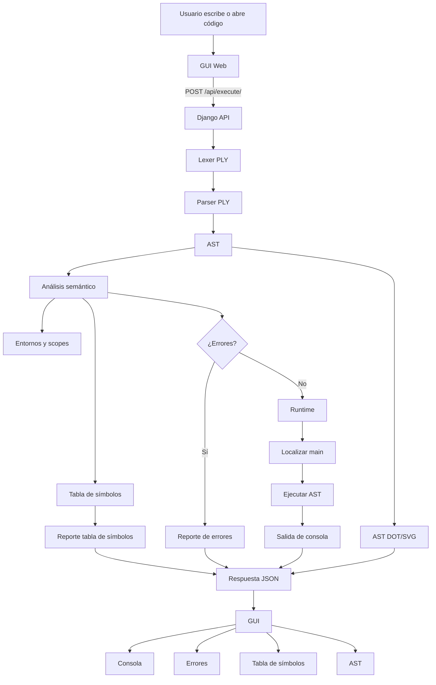
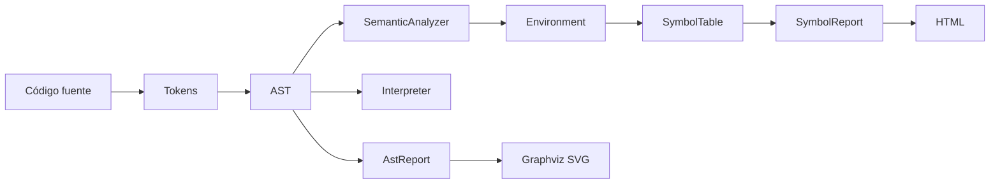

# Flujo de procesamiento

```mermaid
flowchart TD
    A[Usuario escribe o abre código] --> B[GUI Web]
    B -->|POST /api/execute/| C[Django API]
    C --> D[Lexer PLY]
    D --> E[Parser PLY]
    E --> F[AST]
    F --> G[Análisis semántico]
    G --> H[Entornos y scopes]
    G --> I[Tabla de símbolos]
    G --> J{¿Errores?}
    J -- Sí --> K[Reporte de errores]
    J -- No --> L[Runtime]
    L --> M[Localizar main]
    M --> N[Ejecutar AST]
    N --> O[Salida de consola]
    F --> P[AST DOT/SVG]
    I --> Q[Reporte tabla de símbolos]
    K --> R[Respuesta JSON]
    O --> R
    P --> R
    Q --> R
    R --> S[GUI]
    S --> T[Consola]
    S --> U[Errores]
    S --> V[Tabla de símbolos]
    S --> W[AST]
```

## AST y tabla de símbolos

```mermaid
flowchart LR
    SRC[Código fuente] --> TOK[Tokens]
    TOK --> AST[AST]
    AST --> SEM[SemanticAnalyzer]
    SEM --> ENV[Environment]
    ENV --> ST[SymbolTable]
    AST --> RUN[Interpreter]
    ST --> REP[SymbolReport]
    AST --> DOT[AstReport]
    DOT --> SVG[Graphviz SVG]
    REP --> HTML[HTML]
```
